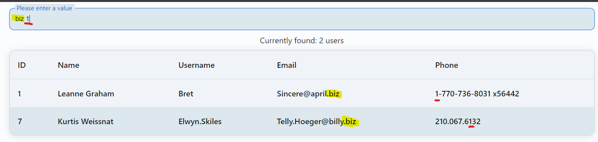

# User Management Table
Fully implemented table of user display.

## Objective

The goal of this project is to create a React application that showcases the following skills:
- **Building a User Management Table:** Display user information fetched from a mock API.
- **Implementing Advanced Filtering:** Enable dynamic search and filtering of user data.
- **State Management with Redux:** Utilize Redux (Classic Redux or Redux Toolkit) for managing state.
- **Ensuring Type Safety:** Leverage TypeScript for comprehensive type safety.

## Features

- **User Table:** Displays user information including name, username, email, and phone.
- **Advanced Filtering:** Search and filter users by name, username, email, and phone with real-time updates.
- **State Management:** Utilizes Redux to manage application state, including user data and filter states.
- **TypeScript:** Ensures type safety across the application to minimize runtime errors.
- **Responsive Design:** User-friendly and visually appealing design for the table and search inputs.

## Setup Instructions

1. **Clone the Repository:**
   ```bash
   git clone https://github.com/volynetstyle/UsersGrid.git
   cd UsersGrid
   ```

2. **Install Dependencies:**
   ```bash
   npm install
   ```

3. **Run the Application:**
   ```bash
   npm run dev
   ```
   Open [http://localhost:3000](http://localhost:3000) in your browser to view the application.

## Deployment

- **Live Application:** [Deployed Application Link](https://usergrid.netlify.app/)

## Optional: Explanation of Approach

- **State Management:** I chose to use Redux Toolkit for a more streamlined state management approach. The slice includes actions for fetching users and updating filter states.
- **Filtering Logic:** Implemented advanced filtering by maintaining filter states in Redux and applying these filters to the user list in real-time.
- **TypeScript:** Ensured type safety by defining types for user data, state, and Redux actions.
- **Design:** Focused on creating a responsive and user-friendly interface using SCSS modules for styling.

## Challenges Faced
Maybe later...

## Application with Theme Example
<p float="left">
  
  
</p>

## Search Example
You can also easily search for data in each column if you enter the information you need through a space


## All screens 

1. **Responsive Design Screen (640px)**:


2. **Responsive Design Screen (768px)**:

